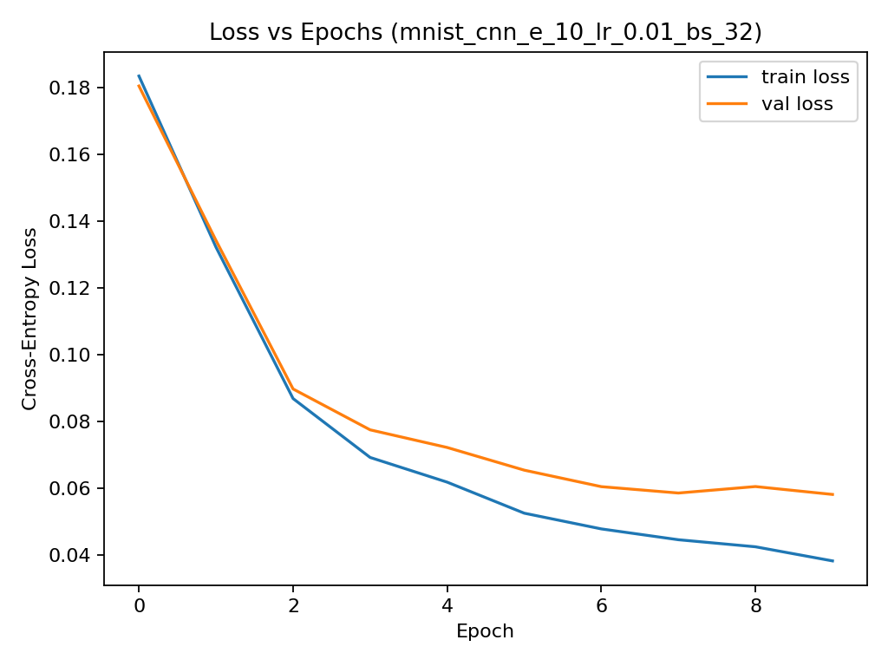
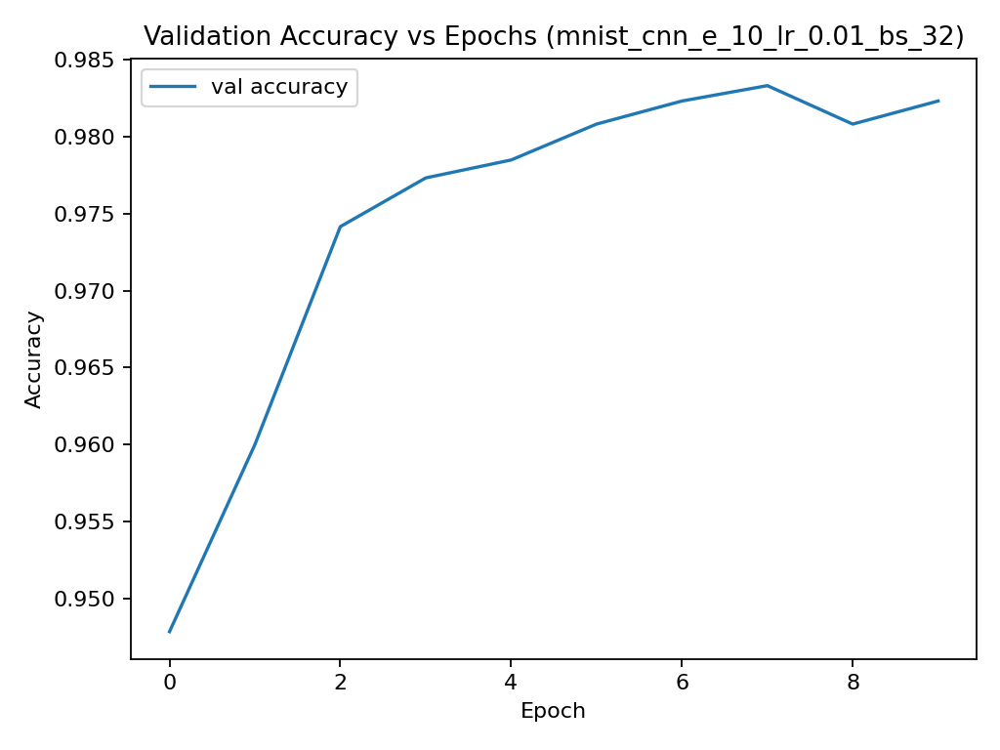
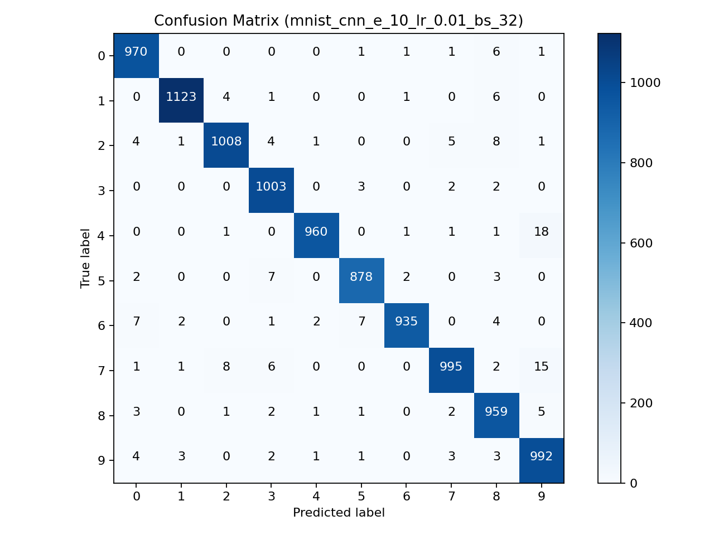

# Neural Network from Scratch on MNIST

## Overview
This project implements a **fully-connected feedforward neural network (one hidden layer)** 
and a **custom CNN (LeNet-5 style)** from scratch using only **NumPy/CuPy**.  
It is trained and evaluated on the **MNIST handwritten digits dataset**, 
comparing baseline vs improved models.

---

## Models

### NN v1 (Baseline)
- One hidden layer (128 units, `tanh` activation).
- Softmax output layer.
- Cross-entropy loss.
- Gradient descent (learning rate = 0.01) with **Xavier initialization**.
- Full-batch training.

### NN v2 (Improved)
- One hidden layer (64–128 units, `ReLU` activation).
- **He initialization** for weights.
- Mini-batch gradient descent.
- **Adam optimizer**.
- **L2 regularization + Dropout**.
- **Early stopping** based on validation loss.

### CNN (Custom LeNet-5 Implementation)
**Architecture**:

| Layer     | Output Shape          | Hyperparams                | Notes |
|-----------|-----------------------|----------------------------|-------|
| Input     | (N, 1, 28, 28)        | —                          | Grayscale MNIST |
| Conv1     | (N, 6, 24, 24)        | k=5, s=1, p=0              | 28→24 |
| ReLU      | (N, 6, 24, 24)        | —                          | — |
| MaxPool1  | (N, 6, 12, 12)        | pool=2×2, stride=2         | 24→12 |
| Conv2     | (N, 16, 8, 8)         | k=5, s=1, p=0              | 12→8 |
| ReLU      | (N, 16, 8, 8)         | —                          | — |
| MaxPool2  | (N, 16, 4, 4)         | pool=2×2, stride=2         | 8→4 |
| Flatten   | (N, 256)              | —                          | 16×4×4 |
| FC1       | (N, 120)              | W: (120, 256)              | He init |
| ReLU      | (N, 120)              | —                          | — |
| FC2       | (N, 84)               | W: (84, 120)               | He init |
| ReLU      | (N, 84)               | —                          | — |
| FC3       | (N, 10)               | W: (10, 84)                | Logits |
| Softmax   | (N, 10)               | axis=1                     | Probabilities |

---

> For **99.5%+**, you usually need batch norm, data augmentation (shift/rotate), 
or a slightly deeper CNN (Conv 32→64).

---

## Combined Results

| Model   | Config                | Batch | LR / Schedule  | WD    | Epochs | Test Acc | Macro F1 | Notes |
|---------|----------------------|-------|----------------|-------|--------|----------|----------|-------|
| NN v1   | 128 (tanh), GD       | Full  | 0.01           | —     | 1000   | 88.09%   | 0.878    | Converges slowly |
| NN v2   | 64 (ReLU), Adam      | 32    | 0.001          | L2    | 10     | 97.56%   | 0.975    | Early stopping |
| **CNN** | LeNet-5 (6→16, 120→84)| 128  | 0.01 → 0.001@10| 5e-4  | 20     | **99.1%**| 0.991    | Classic recipe |

---

## Example Outputs (CNN)

  
  
  

---

## Observations
- **NN v1** struggles, needs ~1000 epochs for ~88%.
- **NN v2** reaches 97%+ within 10 epochs using ReLU + Adam + mini-batches.
- Smaller batches (32/64) with lr=0.001 gave best results.
- CNN (LeNet-5) easily achieves 99% with simple hyperparameters.
- Misclassifications are mostly between visually similar digits (e.g., 1 vs 7, 3 vs 5, 4 vs 9).

---

## Notes
- **GPU (CuPy):** If installed and CUDA works, forward/backward runs on GPU. Otherwise fallback = NumPy.
- **Batch size tuning:** On GPU, 256–512 may be faster; on CPU, 64–128 is better.
- **Numerical stability:** Log-softmax and He initialization are used to stabilize training.

---

## Limitations
- **Implementation difficulty**: Building a fully-connected NN was straightforward, but implementing a CNN purely with NumPy was much more challenging. Convolution especially becomes a bottleneck if too many nested loops are used.  
- **Performance**: A NumPy-based CNN can never match the speed of frameworks like TensorFlow or PyTorch, which are optimized with CUDA/cuDNN. In practice, I observed my NumPy CNN being roughly **10× slower** than TensorFlow’s equivalent.  
- **Accuracy tuning**: While my CNN reached ~99% accuracy, pushing beyond requires more careful architecture design and hyperparameter tuning.  
- **Educational focus**: The purpose here wasn’t to beat TensorFlow/PyTorch in performance, but to really **understand CNNs and NNs from the math level up**. In class, we often stopped at theory (equations and logic), so implementing everything from scratch gave me a deeper intuition of what’s happening under the hood.  

## Future Work
- Add **data augmentation** (random shifts, rotations) to improve robustness and potentially reach >99.5% accuracy.  
- Implement more advanced layers: **Batch Normalization**, **Dropout**, and perhaps even **Residual connections**.  
- Optimize convolution further by removing Python loops entirely and relying on NumPy’s vectorized ops (e.g., `sliding_window_view`).  
- Extend the framework to handle **CIFAR-10** or other color image datasets.  
- Visualize intermediate feature maps and learned filters to better interpret what the CNN is capturing.  

---

## Key Learnings
- Implementing both a simple NN and a CNN from scratch gave me a much deeper intuition about **how forward and backward propagation really work** at the tensor level.  
- I learned that while frameworks like TensorFlow and PyTorch abstract away many details, building it manually showed me the **mathematical mechanics behind each layer**, especially convolutions, pooling, and parameter updates.  
- The project reinforced why **vectorization matters**: replacing nested loops with NumPy/CuPy operations had a massive impact on speed.  
- I also saw firsthand how **initialization choices (Xavier vs He)** and **optimizers (SGD vs Adam)** can make or break training performance.  
- **The biggest takeaway is that by coding the fundamentals myself, I gained an intuition that carries over to any framework or future deep learning project.**
