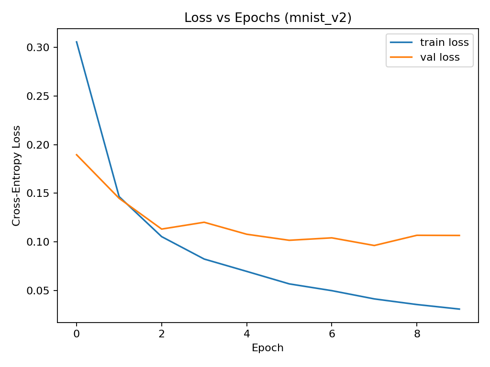
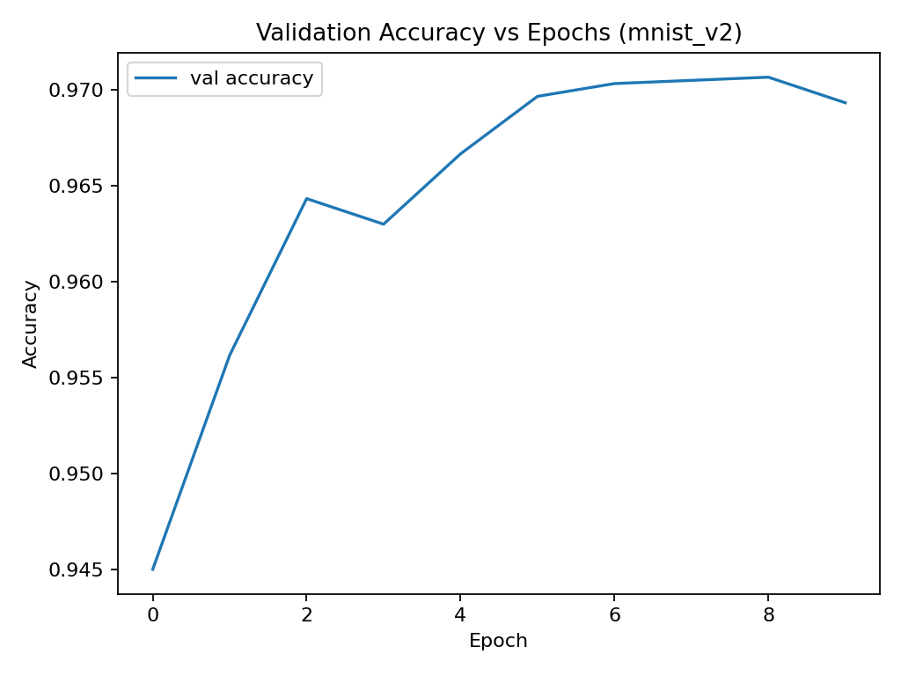
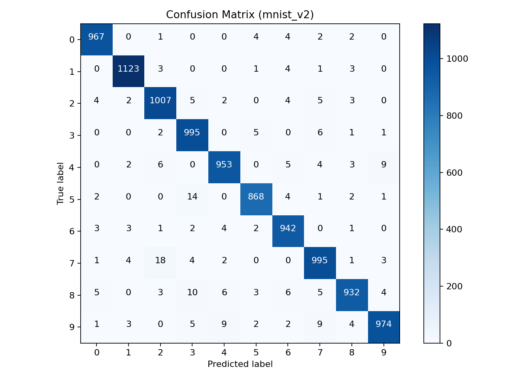

# Neural Network from Scratch on MNIST

## Overview
This project implements a **fully-connected feedforward neural network (one hidden layer)** from scratch using only **NumPy**.  
It is trained and evaluated on the **MNIST handwritten digits dataset**, comparing a **baseline model (NN v1)** and an **improved model (NN v2)**.

---

## Models

### NN v1 (Baseline)
- One hidden layer (128 units, `tanh` activation).
- Softmax output layer.
- Cross-entropy loss.
- Gradient descent (learning rate = 0.01) with **Xavier initialization**.
- Full-batch training.

### NN v2 (Improved)
- One hidden layer (64–128 units, `ReLU` activation).
- **He initialization** for weights.
- Mini-batch gradient descent.
- **Adam optimizer**.
- **L2 regularization + Dropout**.
- **Early stopping** based on validation loss.

---

## 📊 Combined Results

| Model   | Hidden | Batch | LR     | Epochs | Test Acc | Macro F1 | Macro Precision | Macro Recall | Notes |
|---------|--------|-------|--------|--------|----------|----------|-----------------|--------------|-------|
| **NN v1** | 128    | Full  | 0.01   | 10     | 15.26%   | 0.118   | 0.120           | 0.149        | Underfits badly |
| **NN v1** | 128    | Full  | 0.01   | 100    | 70.08%   | 0.666   | 0.719           | 0.692        | Learns features, some confusion |
| **NN v1** | 128    | Full  | 0.01   | 1000   | 88.09%   | 0.878   | 0.880           | 0.879        | Converges well |
| **NN v2** | 64     | 64    | 0.001  | 10     | 97.48%   | 0.975   | 0.975           | 0.975        | Strong generalization |
| **NN v2** | 64     | 32    | 0.001  | 50     | 97.43%   | 0.974   | 0.974           | 0.974        | Stable over longer epochs |
| **NN v2** | 64     | 32    | 0.001  | 10     | **97.56%** | 0.975   | 0.976           | 0.975        | Best run |

---

## 📈 Best Model (NN v2: 64 hidden, batch=32, lr=0.001, 10 epochs)

  
  
  

---

## Observations
- **NN v1** struggles: needs 1000 epochs to reach ~88% test accuracy.
- **NN v2** reaches **97%+ test accuracy within just 10 epochs** using ReLU + Adam + mini-batches.
- Smaller batch sizes (32/64) and lr=0.001 gave the best results.
- Early stopping helped avoid overfitting.
- Misclassifications mostly between visually similar digits (e.g., 3 vs 5, 4 vs 9).

---

## How to Run
```bash
python MNIST_digit_predictions.py
```

Outputs:
- Training logs with loss and accuracy.
- Plots in the `plots/` directory.
- CSV logs in the `results/` directory.
- Final test performance metrics.
